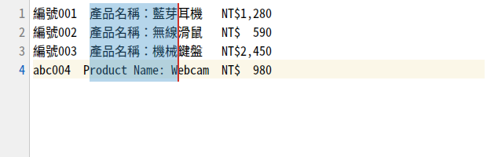

# Stephany Editor

[](LICENSE)

Ubuntu、macOS 與 Windows 桌面上的文字編輯器，重點是**中文能正確使用的欄（直行）模式**
—— 也就是 Notepad++ 的 Column Mode，但把全形字的寬度處理對。



## 安裝

### Ubuntu

建置並安裝 `.deb`：

```bash
./packaging/build-deb.sh
sudo apt install ./dist/stephany-editor_*.deb
```

裝好之後會出現在 GNOME 應用程式選單，也可以從終端機用 `stephany-editor 檔案` 開檔。
移除用 `sudo apt remove stephany-editor`。

套件相依系統的 `python3-pyside6.*`（Ubuntu 24.04 以上內建），不內嵌 venv——
否則會從約 300 KB 膨脹到 100 MB 以上，Qt 也拿不到系統的安全性更新。
建置腳本只用 `dpkg-deb`，不需要 debhelper，也不需要 root。

### macOS

```bash
./packaging/build-app.sh --install     # 建置並安裝到 /Applications
```

只想建不想裝就省略 `--install`，`.app` 會留在 `dist/`；加 `--dmg` 會另外做一個
磁碟映像檔。移除就是把 `.app` 丟垃圾桶。

需要 Python 3.10 以上（macOS 內建的 `/usr/bin/python3` 是 3.9，建置腳本會擋下來
並告訴你怎麼指定別的：`PYTHON=/opt/homebrew/bin/python3.13 ./packaging/build-app.sh`）。
其餘只用 macOS 自己就有的 `python3 -m venv`、`iconutil`、`hdiutil`——
不需要 py2app、PyInstaller，也不需要 Xcode 專案或 root。

終端機指令要另外接上：

```bash
sudo ln -sf "/Applications/Stephany Editor.app/Contents/Resources/bin/stephany-editor" \
    /usr/local/bin/stephany-editor
```

`.app` 沒有經過 Apple 簽章。自己這台機器建的可以直接用；若是透過 `.dmg`
拿到另一台 Mac，在收到端解除隔離即可：

```bash
xattr -dr com.apple.quarantine "/Applications/Stephany Editor.app"
```

### Windows

```powershell
python packaging\build-win.py --install
```

會建到 `dist\StephanyEditor`，再安裝到 `%LOCALAPPDATA%\Programs\StephanyEditor`，
並在「開始」功能表建立捷徑、把本程式登記到檔案的「開啟方式」清單。
省略 `--install` 就只建不裝。全部都在你自己的使用者目錄與 `HKCU` 底下，
**不需要系統管理員，也不會跳 UAC**。

移除：

```powershell
python packaging\build-win.py --uninstall
```

會刪掉安裝目錄、捷徑與登錄機碼；`%APPDATA%\StephanyEditor` 裡的設定與巨集
保留。

需要 Python 3.10+。只用 `python -m venv` 與標準函式庫，**不需要 PyInstaller、
cx_Freeze 或 Inno Setup**。終端機指令把安裝目錄加進 `PATH` 即可：

```powershell
setx PATH "%PATH%;%LOCALAPPDATA%\Programs\StephanyEditor"
```

## 從原始碼執行

```bash
./run.sh                  # 第一次執行會自動建立 .venv 並安裝 PySide6
./run.sh samples/demo.txt # 開啟範例檔
./install-desktop.sh      # Ubuntu：只註冊桌面項目，不安裝套件
```

Windows 沒有 `run.sh`（那是 bash 腳本），直接用模組跑：

```powershell
py -3 -m venv .venv
.venv\Scripts\pip install -r requirements.txt
.venv\Scripts\python -m stephany samples\demo.txt
```

需求：Python 3.10+。字型在 Ubuntu 上建議 `Noto Sans Mono CJK TC`
（`sudo apt install fonts-noto-cjk`）；macOS 一般不必裝任何東西，程式會挑到系統
內建的 `Osaka Regular-Mono`；繁中／簡中／日文語系的 Windows 也不必裝
（會挑到 `細明體`／`NSimSun`／`MS Gothic`）。理由都見下面「中文寬度是怎麼處理的」。

## 跨平台的快速鍵

快速鍵只維護一份，Qt 會在 macOS 自動把 `Ctrl` 對映成 `⌘`——底下表格寫
`Ctrl` 的地方，在 Mac 上按的就是 `⌘`，`Alt` 則是 `⌥`。

有些鍵在 macOS 或 Windows 上按不到，所以**另外多綁了一個**（原本的鍵仍然有效）：

| 動作 | 跨平台 | 另可用 | 哪個平台、為什麼 |
|---|---|---|---|
| 切換書籤 | `Ctrl`+`F2` | `⇧`+`⌘`+`M` | macOS：MacBook 預設要壓 `Fn` 才送得出功能鍵 |
| 下一個／上一個書籤 | `F2` / `Shift`+`F2` | `⌥`+`⌘`+`↓` / `↑` | macOS：同上 |
| 操作說明 | `F1` | `⌘`+`?` | macOS：同功能鍵 |
| 欄位編輯器 | `Alt`+`C` | `Ctrl`／`⌘`+`Shift`+`C` | **macOS**：`⌥C` 會直接打出 `ç`；**Windows**：被選單列的 `編碼(&C)` 助憶鍵吃掉 |

最後一列是同一個功能在兩個平台各自壞掉、卻可以用同一個替代鍵解決的例子——
所以三個平台的 `Ctrl/⌘`+`Shift`+`C` 都是欄位編輯器。

## 欄（直行）模式

### 進入

| 操作 | 說明 |
|---|---|
| `Alt` + 滑鼠拖曳 | 拉出矩形選取 |
| `Alt` + `Shift` + 方向鍵 | 從游標處展開矩形 |
| `Ctrl` + `Shift` + `B` | **黏著式欄選取** —— 之後直接拖曳就是矩形 |

> **GNOME 使用者請注意**：Ubuntu 預設可能把 `Alt` + 拖曳當成「搬移視窗」而吃掉事件。
> 遇到這種情形請用 `Ctrl` + `Shift` + `B` 的黏著模式，或改掉系統設定：
> ```bash
> gsettings set org.gnome.desktop.wm.preferences mouse-button-modifier '<Super>'
> ```
> macOS 沒有這個問題，`⌥` + 拖曳本來就是原生的矩形選取手勢。

### 在欄模式中

| 按鍵 | 動作 |
|---|---|
| 直接打字（含注音／拼音） | 每一行的同一欄位都插入 |
| `Backspace` / `Delete` | 整個矩形一起刪除 |
| `Ctrl`+`C` / `Ctrl`+`X` / `Ctrl`+`V` | 矩形複製、剪下、貼上 |
| `Alt` + `C` | 欄位編輯器：整欄插入文字或遞增數列 |
| `Ctrl` + `Z` | 整個矩形操作一次還原 |
| `Esc` 或方向鍵 | 回到一般模式 |

矩形寬度為零時就是**多重游標**：每一行同一欄位各有一個插入點。

## 中文寬度是怎麼處理的

這是整個專案的核心，也是直接套用一般編輯器會出錯的地方。

**一個中文字 = 兩欄。** 所有矩形運算都以「顯示欄位」而不是「第幾個字元」為單位：

```
你好ab   ->  你(2欄) 好(2欄) a(1欄) b(1欄)  = 6 欄，但只有 4 個字元
```

如果用字元索引去算，中英混排時畫面上的「矩形」會變成鋸齒狀。

**矩形邊界切到半個中文字時，那個字會變成兩個空白。**

```
你好世界        選取第 1~5 欄        刪除後
^^^^^^^^        ------>             "  界"
 └──┬──┘
    切在「你」和「世」的中間
```

這是 Emacs rectangle 的作法。另一個選擇（整個字算進去或整個排除）會讓矩形歪掉，
後續插入位置跟著錯位。寧可補空白保持對齊。

`Backspace` 的刪除寬度取決於**游標所在那一行**左邊那個字，統一套用到所有行，
這樣矩形才會保持是矩形。

**TAB** 的寬度與位置相依（下一個定位點），所以寬度計算一律是從行首往右走。
切到 TAB 中間時同樣降級成空白。

### 字型：這個前提得先成立

上面所有規則的前提，是所用字型的中文**剛好**是半形的兩倍寬。不成立的話畫面上
的「矩形」會是鋸齒狀，狀態列會出現紅字警告。

Ubuntu 裝 `fonts-noto-cjk` 就有了。**macOS 一個內建等寬字型都不符合**——因為
Menlo、Monaco、Courier New、Andale Mono、PT Mono 都沒有中文字符，中文是由系統的
CJK 字型遞補算圖的（寬度固定等於字級），而它們的半形寬都不是字級的一半：

| 字型（12pt） | 半形寬 | 中文寬 | 比例 |
|---|---|---|---|
| Menlo | 7.22 | 12.00 | 1.66 |
| Monaco | 7.19 | 12.00 | 1.67 |
| Andale Mono | 7.19 | 12.00 | 1.67 |
| **Osaka `Regular-Mono`** | **6.00** | **12.00** | **2.00** ✅ |

所以 macOS 上預設挑的是系統內建的 **Osaka Regular-Mono**（9~24pt 全部量測過，
連 Osaka 本身沒有、要靠系統遞補的繁體字與全形標點也是準的）。注意它必須指名
**樣式**：`Osaka` 的預設樣式比例是 1.5，只有 `Regular-Mono` 是 2.0。

Osaka 是隨 macOS 安裝的字型資產，一般桌面安裝都有；少數精簡過的映像（例如
CI runner）沒有，這時會退回 Menlo 並在狀態列出現紅字警告，自己裝一個就好。

**Windows 也是一個都不符合**——一定裝得到的那幾個等寬字型全部不合格：

| 字型（12pt） | 半形寬 | 中文寬 | 比例 |
|---|---|---|---|
| Lucida Console | 9.64 | 16.00 | 1.66 |
| Courier New | 9.59 | 16.00 | 1.67 |
| Cascadia Mono | 9.38 | 16.00 | 1.71 |
| Consolas | 8.80 | 16.00 | 1.82 |
| **PMingLiU** | 7.52 | 16.00 | **2.13** ⚠ |
| **細明體 / `MingLiU`** | **8.00** | **16.00** | **2.00** ✅ |
| **`NSimSun`／`MS Gothic`** | **8.00** | **16.00** | **2.00** ✅ |

合格的是 Windows 的**語言補充字型**：繁中的 `細明體`（`MingLiU`）、簡中的
`NSimSun`、日文的 `MS Gothic`，這三種語系的 Windows 預設就有。程式依
繁中 → 簡中 → 日文的順序挑。

注意 `PMingLiU` 那一列：只比 `MingLiU` 多一個 `P`（proportional，半形字不是
固定寬），比例就變成 2.13。同理還有 `MS PGothic`——名字太像，所以這條規則
是寫成測試擋著的，不是靠 code review。

一台乾淨的 en-US Windows 可能一個語言補充字型都沒有，這時會退回 `Consolas`
並在狀態列出現紅字警告。到「設定 → 時間與語言 → 語言與地區」把中文的
語言功能裝起來，或自己裝 `Noto Sans Mono CJK TC` 都可以。

裝了 `Sarasa Mono TC` 或 `Noto Sans Mono CJK TC` 的話，三個平台都會優先用那些。

## 書籤

| 按鍵 | 動作 |
|---|---|
| `Ctrl` + `F2` | 切換目前行的書籤（行號欄出現藍點） |
| `F2` / `Shift` + `F2` | 跳到下一個／上一個書籤，到底會繞回 |
| 書籤選單 | 反轉、清除、複製／剪下／刪除所有書籤行 |

書籤會跟著它標記的那一行走：在上方插入或刪除文字時自動平移，那一行被刪掉時
書籤一併消失。刪除所有書籤行算一次 `Ctrl`+`Z`。

## 巨集

| 按鍵 | 動作 |
|---|---|
| `Ctrl` + `Shift` + `R` | 開始／停止錄製 |
| `Ctrl` + `Shift` + `P` | 播放一次 |
| 巨集選單 | 播放多次或跑到檔尾、命名儲存、管理已存巨集 |

**錄的是編輯動作，不是鍵盤按鍵。** 「插入『※』」「游標下移一行」「矩形往下
展開 3 行」這種語意命令，而不是「按了哪個鍵」。這個決定（規格 D-01）帶來三件事：

- 換個位置重播也正確——欄模式的步驟記的是相對位移
- 中文輸入法打的字錄得起來（錄的是送出的字串，不是注音按鍵）
- 巨集能存成 JSON 跨 session 使用，人類可讀、可以手改。檔案位置依平台慣例：
  Linux 是 `~/.config/StephanyEditor/macros.json`，macOS 是
  `~/Library/Application Support/StephanyEditor/macros.json`。
  想在幾台機器間共用就設 `STEPHANY_CONFIG_DIR` 指到雲端同步目錄

整段重播（含所有迭代）算一次 `Ctrl`+`Z`。「跑到檔尾」會在游標到達結尾、
或偵測到巨集空轉時自動停止，並有迭代次數上限防止無窮迴圈。
任何一步失敗會立刻停止並告訴你停在第幾輪的第幾步，不會在錯誤位置繼續做破壞性編輯。

## 程式碼摺疊

| 操作 | 動作 |
|---|---|
| 點行號欄右側的 ▾ / ▸ | 摺疊／展開該區塊 |
| `Ctrl` + `Alt` + `F` | 摺疊游標所在的區塊 |
| `Alt` + `0` / `Alt` + `Shift` + `0` | 全部摺疊／全部展開 |
| `Alt` + `1` ~ `Alt` + `8` | 摺疊到指定層級，較外層維持展開 |

層級判斷用兩種啟發式而不是語法剖析（規格 D-01）：C / Java / JS / JSON 系看
**大括號**（會跳過字串與註解裡的括號），其餘看**縮排**。每支援一種語言就寫一個
parser 的維護成本太高，而這兩種已涵蓋絕大多數實際檔案。

摺疊起來的行會在標頭行尾顯示「⋯ n 行」，不然內容就只是憑空消失。
搜尋、跳至行號、書籤跳轉若落在摺疊區塊內會自動展開；游標也不會被留在
看不見的行上。

## 其他功能

分頁、行號、目前行highlight、語法上色（Python / C 系 / JS / Shell / XML / INI）、
尋找取代（支援正規表示式）、跳至行號、自動換行、顯示空白與 TAB、字型與縮放、
拖放開檔。

**編碼**：自動偵測 BOM 與 UTF-8 / Big5 / Big5-HKSCS / GB18030 / Shift-JIS
（繁中環境刻意把 Big5 排在 GB18030 之前，否則 Big5 檔會被解成亂碼）。
可指定編碼重新開啟、轉換編碼儲存；存檔時若有字元無法用該編碼表示會先警告。
換行字元 CRLF / LF / CR 可切換。

## 專案結構

```
stephany/
├── platforms.py       # 平台差異的唯一集中處：字型、設定目錄、替代鍵
├── core/              # 純邏輯，不依賴 Qt，可單獨測試
│   ├── widths.py      # 顯示寬度、欄位 <-> 字元索引轉換
│   ├── block.py       # 矩形的取出／插入／刪除／取代／數列
│   ├── linemarks.py   # 行號標記集合與文件變動時的平移（書籤與摺疊共用）
│   ├── bookmarks.py   # 書籤
│   ├── folding.py     # 可摺疊區塊偵測（縮排／大括號）與摺疊狀態
│   ├── macro.py       # 巨集步驟、錄製、序列化、重播停止條件
│   └── document.py    # 編碼偵測、BOM、換行字元
├── resources/         # 圖示（隨套件安裝，原始碼執行時也找得到）
└── ui/
    ├── editor.py        # 編輯器 widget：矩形繪製、滑鼠鍵盤、輸入法、書籤、摺疊
    ├── commands.py      # 語意命令層：所有可錄製、可重播的編輯動作
    ├── theme.py         # 由系統配色推導的主題色（深／淺色都可讀）
    ├── mainwindow.py    # 分頁、選單、狀態列
    ├── dialogs.py       # 尋找取代、欄位編輯器、跳至行號
    ├── macro_dialogs.py # 巨集播放與管理
    ├── highlighter.py   # 語法上色
    └── linenumbers.py   # 行號欄、書籤標記、摺疊箭號
```

打包腳本各平台一支：`packaging/build-deb.sh`（Ubuntu）、
`packaging/build-app.sh`（macOS）、`packaging/build-win.py`（Windows），
圖示則三個平台共用 `packaging/make-icons.py` 從同一個 SVG 產生
（hicolor PNG／`.iconset`／`.ico`）。

CI 的核心測試 job 刻意**不安裝 PySide6**，並檢查 `core/` 沒有 import 到 Qt——
讓「領域核心與 UI 框架分離」這件事持續被驗證，而不只是寫在文件裡。

鍵盤輸入一律先翻成語意命令再經 `perform()` 派送，執行的同時交給錄製器記一筆。
因此「使用者能操作的」與「巨集能重播的」永遠是同一組動作，新增功能時不會
發生忘了接巨集的情況。

文字異動一律先由 `core.block` 算出「每行要改哪一段」（`LineEdit`），再一次套用到
`QTextDocument` 並包進同一個 undo 區塊 —— 所以 `Ctrl+Z` 會把整個矩形操作一次還原。

中文輸入法的處理：組字過程交給 Qt 原生顯示（候選字窗位置才會正確），
只攔截「送出」那一刻，把送出的字串套用到矩形的每一行。

## 測試

```bash
.venv/bin/python -m pytest tests -q
```

388 個測試，涵蓋：

- **寬度與矩形**：切到全形字、切到 TAB、短行不被撐長、剪下再貼回可還原
- **書籤**：文件增減行時的平移、被刪除的行、繞回式跳轉、連續區間合併
- **巨集**：步驟合併、JSON 來回、損毀檔案的降級、重播的三個停止條件
- **摺疊**：縮排與大括號兩種偵測、字串與註解裡的括號不算、巢狀層級
- **主題**：深淺兩種配色下，文字在當前行反白上的 WCAG 對比度必須 >= 4.5
- **打包**：app_id 與 .desktop 的一致性、安裝路徑、權限與相依宣告
- **平台**：字型清單上標成「對得齊」的每一個字型都實際量測、設定目錄慣例、
  macOS 替代鍵確實綁上、`Info.plist` 與 bundle id 的一致性
- **GUI**：輸入法送字、矩形複製貼上、undo、跨分頁共用錄製器、選單動作接線
- **macOS**：`⌥`+字母不得被當成輸入、`Ctrl` 確實對映成 `⌘`、
  「關於／結束」的選單角色、Finder 開檔事件
- **Windows**：字型比例跨 9/12/18/24pt 與 19 個字元都是 2.0、`PMingLiU`
  確實不對齊（規則不是憑空訂的）、`Alt`+`C` 確實被選單助憶鍵吃掉、
  `AppUserModelID` 讀得回來、捷徑與登錄機碼寫進去再讀回來、
  建好的安裝樹沒有建構期殘留

## 桌面整合

工作列／Dock 要正確顯示應用程式名稱與圖示，靠的是三個值完全一致：

| 位置 | 值 |
|---|---|
| `QGuiApplication.setDesktopFileName()` | `stephany-editor` |
| `/usr/share/applications/` 底下的檔名 | `stephany-editor.desktop` |
| desktop 檔的 `StartupWMClass` | `stephany-editor` |

Qt 6 在 Wayland 下用 `desktopFileName()` 當 xdg-shell 的 `app_id`，桌面環境再拿它
去比對已安裝的 `.desktop`。這個值若沒設（Qt 預設是空的），就會退回用執行檔名稱
——於是 Dock 上顯示成 `python3`。這三者的一致性有測試把關（`tests/test_packaging.py`）。

### macOS 是同一個問題的另一種版本

macOS 的身分不是程式自己喊的，是 `NSBundle` 認出來的，而 `NSBundle` 只認
**目前執行檔的路徑**。實測同一支程式、同一份 `Info.plist`，只差在
`Contents/MacOS/` 底下放什麼：

| 作法 | 選單列顯示 |
|---|---|
| shell 腳本 `exec` 專案 `.venv` 的 python | `main.py` ❌ |
| Python 直譯器本體放在 `Contents/MacOS/stephany-editor` | `Stephany Editor` ✅ |

`setApplicationName()` 救不了第一種——Qt 讀不到 `CFBundleName` 時是退回執行檔
名稱，不是退回 `applicationName`。

所以 `.app` 是這樣組的：venv 直接建在 `Contents/` 之下（`pyvenv.cfg` 與 `MacOS/`
同層，Python 找 venv 標記剛好就找得到），直譯器複製一份到
`Contents/MacOS/stephany-editor`，進入點掛在 site-packages 的 `sitecustomize.py`
——因為 LaunchServices 啟動它時不給任何參數，那是唯一不必改直譯器就能掛上
進入點的位置。終端機用法則走 `Contents/Resources/bin/stephany-editor` 這個包裝
腳本，用 `-m stephany` 呼叫同一個直譯器，命令列參數才不會被 Python 自己吃掉。

Finder 雙擊開檔也不走 `argv`，而是送 `QFileOpenEvent`；事件可能比主視窗還早到，
所以先排隊，等視窗建好再補開。

應用程式選單裡的「關於／服務／隱藏／結束」不是本專案建的項目，是 Qt 依 macOS
慣例自己組出來的，字串由 Qt 的翻譯檔提供。啟動時載入隨 Qt 安裝的
`qtbase_zh_TW`，那幾項才會跟其餘介面一樣是中文；`QMessageBox` 的「確定／取消」
也是同一批字串，所以各平台都一起受惠。

### Windows 是同一個問題的第三種版本

Windows 認的是**執行檔路徑**——而從原始碼跑的話，所有 Python 程式的執行檔
路徑都是同一個 `pythonw.exe`，於是工作列把本程式跟其他 Python 程式分到同一組，
工作管理員也顯示成 `pythonw`。

所以安裝時把 venv 的 `pythonw.exe` 複製成 `stephany-editor.exe`（GUI，不開主控台）、
`python.exe` 複製成 `stephany-editor-cli.exe`（終端機用），另外再以
`SetCurrentProcessExplicitAppUserModelID` 宣告一次身分，並把**同一個**識別碼寫進
「開始」功能表捷徑的 `System.AppUserModel.ID`——釘選的捷徑與執行中的視窗要被
認成同一個應用程式，靠的就是這兩邊相同。

| 平台 | 身分由誰認定 | 宣告在哪 |
|---|---|---|
| Linux | 桌面環境比對 `.desktop` | `setDesktopFileName()` + `.desktop` 檔名 |
| macOS | `NSBundle` 看執行檔路徑 | `.app` 的 `Info.plist` |
| Windows | 執行檔路徑 + AppUserModelID | 專屬 `.exe` + 捷徑的 `System.AppUserModel.ID` |

三者的識別碼同源於 `stephany-editor`，由測試把關。

跟 macOS 不同的是，Windows **不需要** `sitecustomize` 那套 hack：改名後的直譯器
仍然認得自己的 venv，而且命令列參數完整保留（macOS 之所以要 hack，是因為
LaunchServices 啟動 `.app` 時不給任何參數）。所以進入點就是正常的
`stephany-editor.exe -m stephany 檔案.txt`，檔案關聯也直接用這個命令。

## 開發狀態

| 模組 | 狀態 |
|---|---|
| 欄（直行）模式（SRS-001） | ✅ 完成 |
| 中文輸入法整合 | ✅ 完成 |
| 編碼偵測與轉換 | ✅ 完成 |
| 語法上色 / 尋找取代 / 分頁 | ✅ 完成 |
| 書籤（SRS-002 F-BM） | ✅ 完成 |
| 巨集錄製（SRS-002 F-MC） | ✅ 完成 |
| 程式碼摺疊（SRS-003 F-FD） | ✅ 完成 |
| 深色／淺色主題 | ✅ 完成 |
| deb 打包與桌面整合（SRS-004 F-PK） | ✅ 完成 |
| macOS 支援與 .app 打包（SRS-005 F-MAC） | ✅ 完成 |
| Windows 支援與安裝（SRS-006 F-WIN） | ✅ 完成 |
| 檔案比對 | ⬜ 未規劃 |
| 工作階段還原 | ⬜ 未規劃 |
| 外掛系統 | ⬜ 未規劃 |

規格文件在 [docs/](docs/)。程式碼註解、測試名稱與 commit message 都引用
規格編號（如 `F-BM-09`、`BR-MC-3`、`D-01`），可以從任一處反查「為什麼這樣做」。

## 授權

GNU 通用公共授權條款第三版或（由您選擇的）任何更新版本 —— GPL-3.0-or-later。
全文見 [LICENSE](LICENSE)。

本程式為自由軟體：您可以自由使用、研究、修改與散布它。若您散布修改後的版本，
必須同樣以 GPL-3.0 授權釋出並提供原始碼。本程式不附帶任何擔保。

Copyright © 2026 Edward Chen

每個原始檔都帶有授權標頭；`tests/test_packaging.py` 會驗證沒有檔案漏掉，
deb 套件的 copyright 檔則依 Debian 政策引用 `/usr/share/common-licenses/GPL-3`
而非重複內嵌全文。
