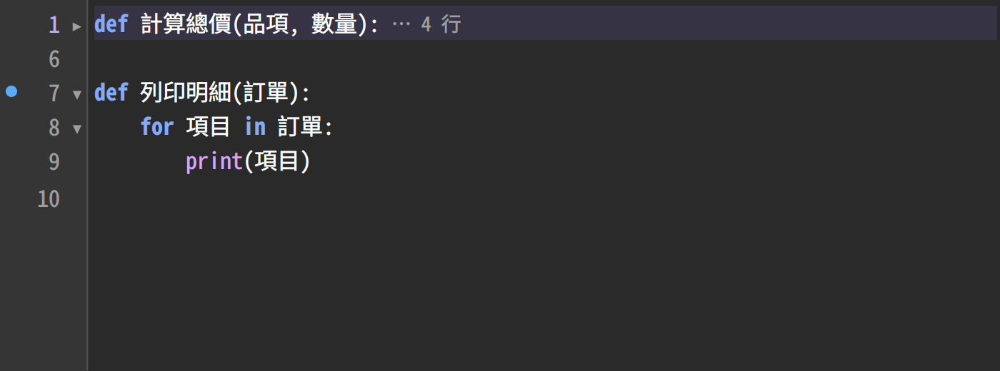

# Markdown 預覽範例

用 `Ctrl`+`Shift`+`V`（macOS 是 `⌘`+`⇧`+`V`）開啟右側的預覽，邊改邊看版面是否正確。

## 文字

**粗體**、*斜體*、~~刪除線~~、`行內程式碼`、<kbd>Ctrl</kbd>+<kbd>C</kbd>。
裸網址會自動變成連結：https://github.com/EdwardCChen/StephanyEditor

> 引言區塊。
>
> > 巢狀引言。

## 清單

- 第一層
  - 第二層
    - 第三層
- 回到第一層

1. 有序清單
2. 第二項
   - 混合無序清單

- [x] 已完成的工作
- [ ] 還沒做的工作

## 表格

| 左對齊 | 置中 | 右對齊 |
|:-------|:----:|-------:|
| 中文   | 寬度 | 123 |
| abc    | ✓    | 4,567.89 |

## 程式碼

```python
def display_width(text: str) -> int:
    """一個中文字 = 兩欄。"""
    return sum(2 if is_wide(ch) else 1 for ch in text)
```

```bash
./run.sh samples/demo.md
```

## 圖片

相對路徑以這個檔案所在的目錄為基準：



## 註腳

欄模式的寬度規則來自 Emacs rectangle[^1]。

---

[^1]: 矩形邊界切到半個全形字時，那個字變成兩個空白。
